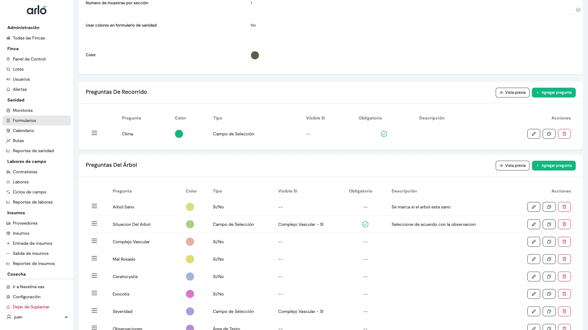
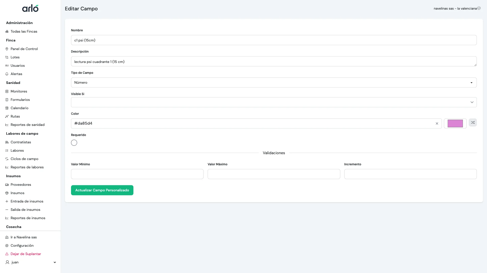
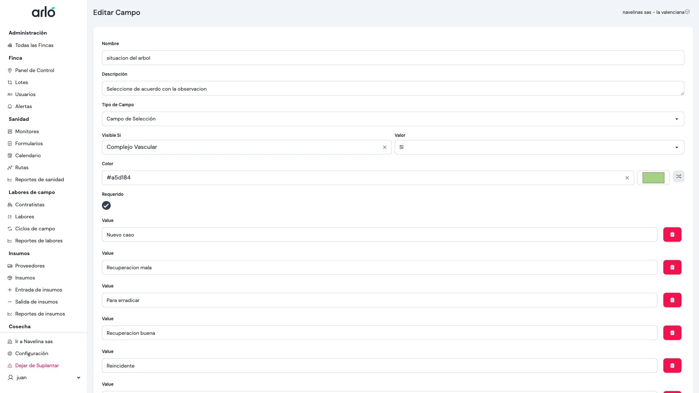
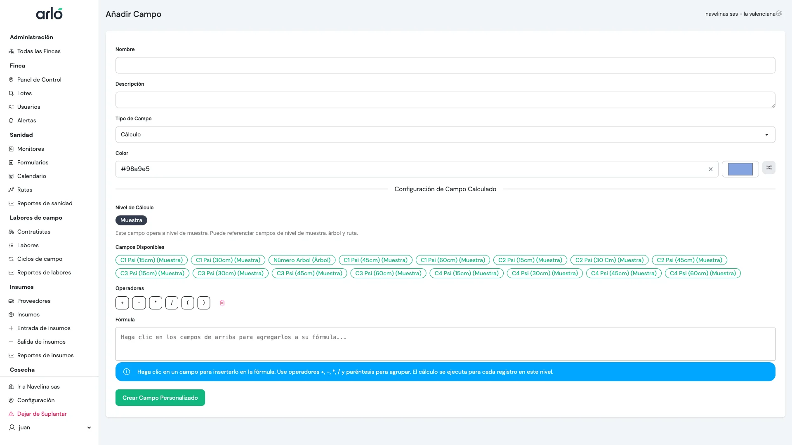

Los Campos Personalizados te permiten adaptar tus formularios de sanidad para recolectar exactamente el tipo de datos que necesitas. Desde números simples hasta fórmulas complejas, puedes construir herramientas poderosas de recolección de datos.

## Agregar Campos Personalizados

Cada formulario de sanidad tiene tres niveles donde puedes agregar campos personalizados: Recorrido, Árbol, y Muestra. Para agregar un campo, haz clic en el botón "Agregar pregunta" en el nivel correspondiente.

La interfaz te permite ver todos los campos existentes organizados por nivel, cada uno mostrando su tipo, color identificador, condiciones de visibilidad, y opciones para editar, duplicar o eliminar.

## Tipos de Campos

Al agregar un campo a un nivel del formulario, puedes elegir entre los siguientes tipos:

| Tipo | Cuándo usarlo |
| :--- | :--- |
| **Texto** | Texto corto como comentarios o nombres. |
| **Área de Texto** | Descripciones u observaciones más largas. |
| **Número** | Para valores que quieras calcular o promediar (ej. "Conteo de plagas"). |
| **Casilla (Checkbox)** | Para indicadores simples de "Sí/No" o "Presente/Ausente". |
| **Lista de Selección** | Elegir una opción de una lista desplegable. |
| **Botones de Radio** | Elegir una opción de una lista visible. |
| **Fecha / Fecha y Hora** | Para registrar momentos específicos o plazos. |
| **Archivo / Foto** | Para adjuntar evidencia fotográfica o documentos. |
| **Asociación** | Vincular la entrada a otro registro en tu finca (ej. un Contratista o Insumo específico). |
| **Calculado** | Para matemáticas automáticas basadas en otros campos. |

---

## Lógica Avanzada

### Validaciones
Puedes asegurar la calidad de los datos estableciendo reglas para tus campos:
- **Obligatorio**: El monitor no puede terminar la entrada sin completar este campo.
- **Valores Mín/Máx**: Para números, puedes establecer límites (ej. "La temperatura debe estar entre 0 y 50").
- **Patrones**: Para texto, puedes forzar formatos como "Solo números" o "Alfanumérico".

En la imagen puedes ver las opciones de validación para un campo numérico: valor mínimo, valor máximo, e incremento (paso).

### Campos Condicionales
Puedes ocultar o mostrar campos basados en otras respuestas.
- *Ejemplo:* Solo mostrar un campo de "Foto" si la casilla de "Plaga presente" está marcada.
- **Nota:** La lógica condicional en los Formularios de Sanidad actualmente funciona basada en campos de tipo **Casilla (Checkbox)**.

La sección "Visible Si" te permite especificar qué campo de casilla debe estar marcado (Sí/No) para que este campo aparezca en el formulario.

### Campos Calculados (Fórmulas)
Los campos calculados realizan operaciones matemáticas automáticamente mientras el monitor ingresa datos.
- **Fórmulas**: Puedes usar operaciones matemáticas estándar (+, -, *, /) y paréntesis.
- **Referencias**: Usa el botón "Insertar Campo" para referenciar otros campos numéricos en tu fórmula.
- **Jerarquía**: Un campo en el nivel de **Muestra** puede referenciar campos de los niveles de **Árbol** y **Ruta**.

El editor de fórmulas muestra los campos disponibles que puedes insertar (organizados por nivel), los operadores matemáticos, y el área de texto donde construyes tu fórmula.

:::warning[Importante para Informes]
Los tipos de campo como **Número**, **Casilla** y **Selección** son los mejores para generar gráficos y mapas claros. Los campos de texto libre son más difíciles de analizar a gran escala.
:::
